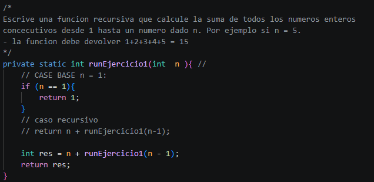
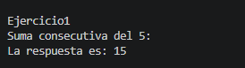
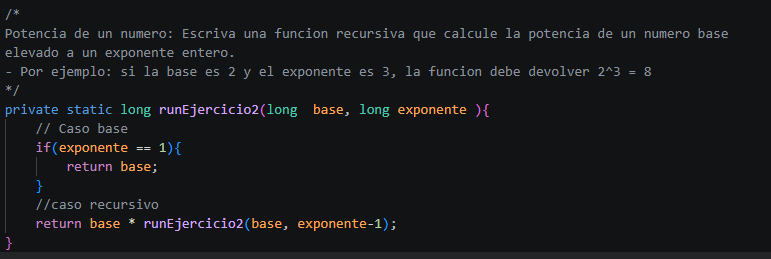
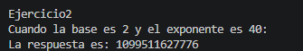

# Práctica: Recursividad 

## Datos del Estudiante
- **Nombre:** Edwin Patricio Pintado Reinoso
- **Curso:** Grupo 1
- **Fecha:** 15/06/2026

---

## 1. Implementacion de ejemplos de resursividad 

**Fecha:** 15/06/2026

**Descripción:** En esta practica se desarrollollaron diferentes metodos, con el objetivo de entender el concepto y aplicacion de recursividad, entre estos la suma de enteros consecutivos desde 1 a n, la potencia de un numero, conociendo la base y el exponente.

---

Ejercicio1: 

Imagenes Ejercio1: La suma de enteros consecutivos desde 1 a n.

- metodo

- ejecución 

---

Ejercicio2: La potencia de un numero, conociendo la base y el exponente. 

- metodo

- ejecución 

